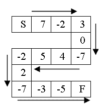

# 跳格问题 2725: 跳格问题

题目给出了一个跳格规则，要求计算跳到终点需要多少步。

[题目来源](http://bailian.openjudge.cn/practice/2725/)

## 2725: 跳格问题

总时间限制: 1000ms    内存限制: 65536kB

### 描述

有一种游戏，在纸上画有很多小方格，第一个方格为起点(S)，最后一个方格为终点。有一个棋子，初始位置在起点上，棋子每次可移动一次，棋子在起点时，可向前移动一个格子到第二个方格内；棋子在其他方格内时，可根据方格内的数字Ni进行移动。如果Ni大于零，就向前移动Ni个格子；如果Ni小于零，就向后移动-Ni个格子；如果Ni等于零，则此次原地不动一次，在下一步移动时可向前移动一步到下一个格子。显然，如果仅按此方案，会出现棋子永远移动不到终点的情形。为防止这种情况发生，我们规定，当棋子再次来到它曾经到过的方格时，它需要原地不动一次，在下一步移动时可向前移动一步到下一个格子。按此方案，棋子总能够走到终点(F)。如果给定一个方格图，试求棋子要走多少步才能从起点走到终点。（注：当然还可能会出现向前移动Ni个格子就跑过终点了，则把棋子放到终点上。如果Ni太小，使得棋子向后移动跑过了起点，则把棋子放到起点上。）（如图所示，其中S代表起点，F代表终点）（只有离开后再次来到一个方格时，才算来到它曾经到过的方格，包括起点S）



### 输入

第一行为所有中间格子的总数n（n<20）（即加上起点小格子和终点小格子，共有n+2个小格子）。

其余各行上分别为一个整数，表示对应的小格子上的初始数字。

### 输出

输出一行，要从起点跳到终点，共要跳多少步。（注：每跳一步，可能跳过多个格子，也可能原地不动）

### 样例输入
```
5
2
3
-2
0
-5
```
### 样例输出
```
19
```
这是一个模拟问题，需要记录每个格子的数值和状态，如果这个格子没有跳过就跳格子中的数字，如果跳过，则向前跳一格而对于格子中数值为0的情况，无论怎样都要向前跳一格。另外要单独处理跳到起点之前和终点之后的情况。
```cpp
#include <iostream>
using namespace std;
int main() {
	int n, i, cur = 0, s = 0;
	cin >> n;
	int *sq = new int[n + 1];
	int *u = new int[n + 1];
	u[0] = 0;
	sq[0] = 1;
	for (i = 0; i < n; ++i) {
		cin >> sq[i + 1];
		u[i + 1] = 0;
		if (sq[i + 1] == 0) {
			u[i + 1] = 1;
			sq[i + 1] = 1;
		}
	}
	while (cur < n + 1) {
		int step = sq[cur];
		if (u[cur] == 1) {
			s++;
		}
		u[cur] = 1;
		sq[cur] = 1;
		cur += step;
		s++;
		if (cur < 0) {
			cur = 0;
		}
	}
	cout << s << endl;
	delete[] u;
	delete[] sq;
	return 0;
}
```
#### [2725.cpp](/Code/2700-2799/2725.cpp) 代码长度：522B 内存：152kB 时间：5ms 通过率：88% 最小内存：152kB  最短时间：0ms

这里用两个数组来分别存储格子中的数字和格子的状态，最后模拟跳格子的过程，即下标的变化即可。

有任何的改进意见欢迎大家在微信平台公众号主页面留言或者发表issue。
